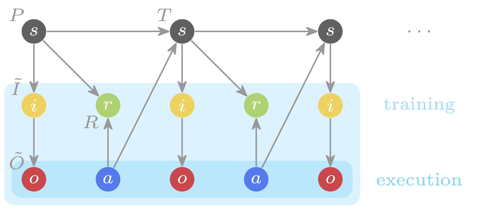

# Informed POMDP: Leveraging Additional Information in Model-Based RL

Official implementation of the [Informed Dreamer][informed], an adaptation of [Dreamer][mastering] to Informed POMDPs.



If you find this code useful, please reference in your paper:
```
@article{lambrechts2023informed,
  title={{Informed POMDP: Leveraging Additional Information in Model-Based RL}},
  author={Lambrechts, Gaspard and Bolland, Adrien and Ernst, Damien},
  journal={ICML Workshop on New Frontiers in Learning, Control, and Dynamical Systems},
  year={2023},
}

@article{hafner2023dreamerv3,
  title={Mastering Diverse Domains through World Models},
  author={Hafner, Danijar and Pasukonis, Jurgis and Ba, Jimmy and Lillicrap, Timothy},
  journal={arXiv preprint arXiv:2301.04104},
  year={2023}
}
```

To learn more:

- [Research paper][informed]
- [Poster summary][poster]
- [Twitter summary][tweet]

## Instructions

For installation, examples and tips, see the original [Dreamer repository][dreamer].

This repository implements the following **Informed POMDPs**:

- Varying Mountain Hike (state informed)
- Flickering Atari (annotated-RAM informed)
- Velocity DeepMind Control (state informed)
- Flickering DeepMind Control (state informed)

By convention, the observation keys starting with `info_` are considered as part of the information $i$, while the other observation keys are considered as part of the observation $o$.

The **Informed Dreamer** and the **Uninformed Dreamer** agents can be trained as follows:

- For the **informed POMDP** training, use `--decoder.outputs 'info_.*'` that only uses the information.
- For the **classical POMDP** training, use `--decoder.outputs '^(?!info_).*'` that ony uses the observation.

For both the information and the observation, use `--decoder.outputs '.*'` (untested).

## Experiments

### Varying Mountain Hike

```bash
python dreamerv3/train.py --logdir logs/$(date '+%Y-%m-%d_%H.%M.%S') \
    --configs hike --task 'hike_foo' --env.hike.discrete True \
    --configs hike --env.hike.altitude False --env.hike.rotations True \
    --decoder.outputs 'info_.*'
```

### Flickering Atari

```bash
python dreamerv3/train.py --logdir logs/$(date '+%Y-%m-%d_%H.%M.%S') \
    --configs atari100k --task 'atari_pong' --env.atari.flickering 0.5 \
    --decoder.outputs 'info_.*'
```

### Velocity Control

```bash
python dreamerv3/train.py --logdir logs/$(date '+%Y-%m-%d_%H.%M.%S') \
    --configs dmc_velocity --task 'dmc_hopper_stand' \
    --decoder.outputs 'info_.*'
```

### Flickering Control

```bash
python dreamerv3/train.py --logdir logs/$(date '+%Y-%m-%d_%H.%M.%S') \
    --configs dmc_vision --task 'dmc_hopper_stand' --env.dmc.flickering 0.5 \
    --decoder.outputs 'info_.*'
```

[mastering]: https://arxiv.org/abs/2301.04104
[informed]: https://arxiv.org/abs/2306.11488
[dreamer]: https://github.com/danijar/dreamerv3
[poster]: https://people.montefiore.uliege.be/lambrechts/pdf/informed-pomdp-poster.pdf
[tweet]: https://twitter.com/GsprdLambrechts/status/1671465542685798400?s=20
